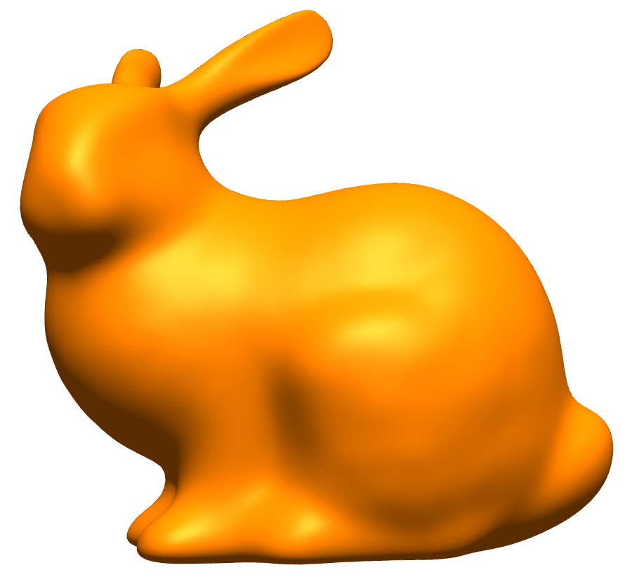

# Géométrie Numérique - TP 3 : Lissage de surfaces (module *algorithms* de PMP)

## Objectifs théoriques

- Explorer les approches de lissage de maillages vues en cours
- Comprendre leur différences
- Décoder un code qui n'est pas le votre

## Objectifs pratiques

- Tester les méthodes de lissages offertes par PMP
- Implémenter les lissages de Taubin et de Desbrun
- Analyser l'impact des paramètres

## Exercice 1 - Trois algorithmes de lissage

La bibliothèque PMP implémente trois des algorithmes de lissage vus en cours :
1. le lissage laplacien explicite (c.f. la méthode `explicit_smoothing()` de la classe `SurfaceSmoothing` dans la documentation)
2. le lissage laplacien implicite, aussi appelé flot de diffusion (c.f. méthode `implicit_smoothing()` de la classe `SurfaceSmoothing`)
3. le profillage (*fairing*) implicite minimisant la courbure, aussi appelé flot de courbure (c.f. méthode `fair()` de la classe `SurfaceFairing`)

Dans cet exercice, vous comparez attentivement les codes de ces trois méthodes :
- Quelles sont les différences ?
- Testez ces algorithmes sur les fichiers OFF fournis sur Seafile (https://seafile.unistra.fr/d/b630610d87af4e4e899e/), en faisant varier les paramètres.
- Comparez les résultats obtenus.
- Quels sont les avantages et les inconvénients de chaque algorithme, et quelle influence a chaque paramètre ?

## Exercice 2 : Préservation du volume

Les méthodes de lissage peuvent mener à une perte de volume de l'objet entouré par la surface, comme vous l'avez peut-être constaté en appliquant les algorithmes précédents.
Afin de remédier à ce problème, deux solutions ont été proposées :
1. Taubin

    Taubin [2] propose d'alterner *iter* fois (*iter* = nombre d'itérations, choisi par l'utilisateur) entre :
    1. une étape de lissage laplacien explicite, où la position $X$ de tout sommet de la surface est remplacée par $X + \lambda LX$, avec $L$ l'opérateur laplacien discret et $\lambda$ un paramètre choisi
    par l'utilisateur (attention, dans la méthode *explicit_smoothing()* de PMP, $\lambda$ est fixé à 0.5)
    2. une étape de "*gonflement*", où la position $X$ de tout sommet de la surface est remplacée par $X − \mu LX$, avec $\mu$ un paramètre choisi par l'utilisateur.

    Implémentez cet algorithme.
    Testez-le sur les fichiers OFF fournis, en faisant varier les paramètres
    λ et μ. μ doit être strictement supérieur à λ mais très proche.

    > **Conseil :** modifier la classe `SurfaceSmoothing` de PMP pour que ses méthodes soient *protected*, créer une classe dérivée de `SurfaceSmoothing` qui réimplémente la méthode `explicit_smoothing` an ajoutant le paramètre $\lambda$ aux arguments. 
    > **Note :** ne pas oublier de recompiler PMP après des modifications de son code !

2. Desbrun
    
    Desbrun et al. [1] proposent d'ajouter une étape de correction des positions des sommets de la surface après un lissage laplacien, qu'il soit explicite ou implicite.
    Cette correction se fait de la manière suivante.
    On note $V$ le volume de l'objet entouré par la surface avant lissage, et $V'$ ce volume après lissage.
    $V$ et $V'$ sont calculés d'après la formule :
    $$V = \dfrac{1}{6} \sum^{Nf}_{k=1} g_{k} \cdot N_{k}$$
    avec $g_{k}$ la moyenne des positions des sommets de la $k$-ème face et $N_{k}$ la normale à cette face.
    La correction des positions de chaque sommet de la surface se fait par simple multiplication des positions obtenues par un facteur $\beta = (V /V')^{1/3}$.
    Implémentez cet algorithme.
    Testez-le sur les fichiers OFF fournis, et comparez avec l'algorithme de Taubin

## Bibliographie

1. M. Desbrun, M. Meyer, P. Schröder, A.H. Barr. *Implicit fairing of irregular meshes using diffusion and curvature flow*. Proceedings of ACM SIGGRAPH, 1999.
1. G. Taubin. *A signal processing approach to fair surface design.* Proceedings of ACM SIGGRAPH, 1995.